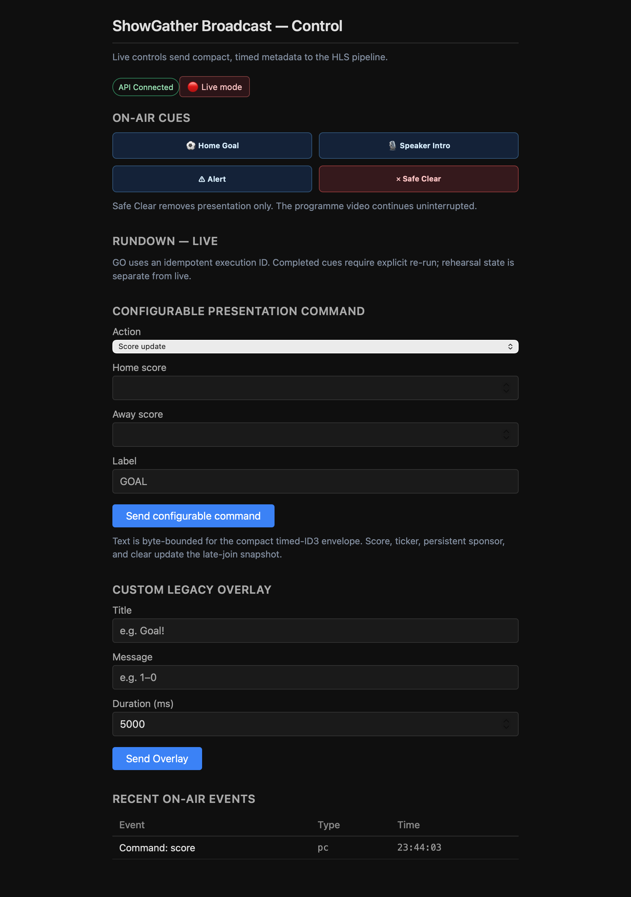
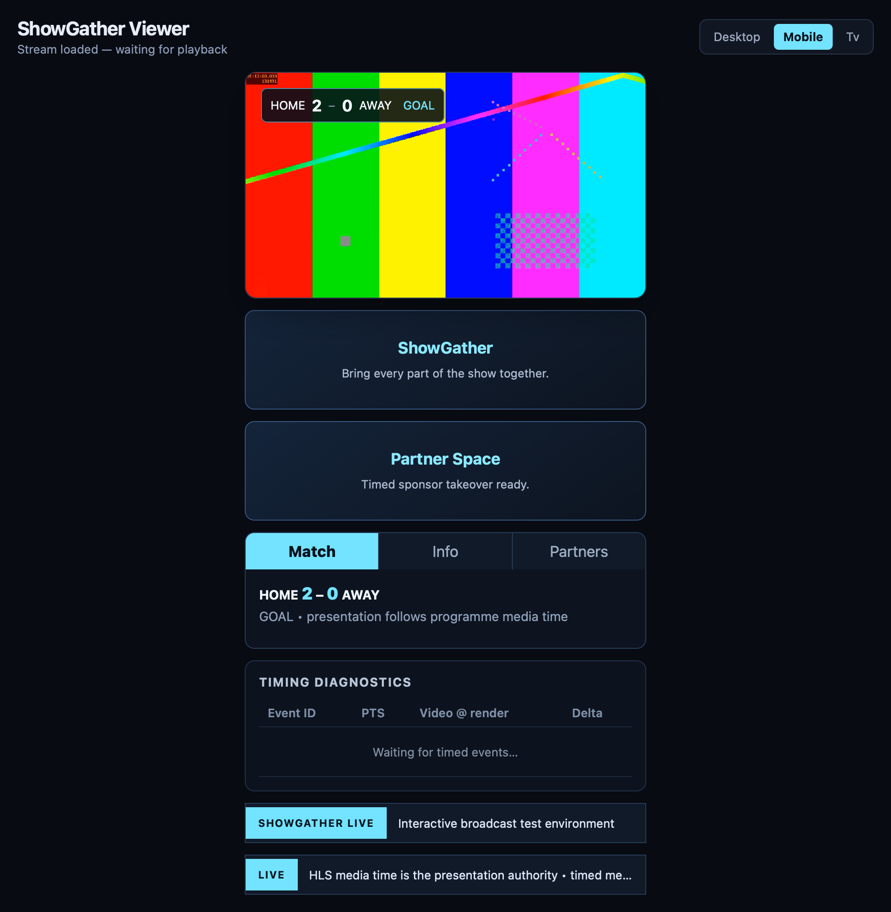

# ShowGather V1 Pilot Demonstration Runbook

## Start locally

From `broadcast/`:

```bash
pnpm pilot:up
```

Wait for `http://localhost:3001/api/health` to return `status: ok`, then open:

- Admin: `http://localhost:3002`
- Desktop viewer: `http://localhost:3003`
- Mobile companion viewer: `http://localhost:3003/?profile=mobile`
- TV viewer: `http://localhost:3003/?profile=tv`
- Rehearsal mobile viewer: `http://localhost:3003/?profile=mobile&rehearsal=1`

Stop the local stack with `pnpm pilot:down`.

## Repeatable live demonstration

Use the Admin **Rundown — Live** section in order:

1. **Opening score** — proves durable score state and snapshot hydration.
2. **Host lower third** — proves a media-timed on-video transient.
3. **Home goal** — proves score update plus revisioned durable state.
4. **Partner takeover** — proves a temporary surround-region takeover and restoration.
5. Use **Configurable presentation command** to send a ticker update.
6. Send a configurable alert.
7. Use **Safe Clear** outside the rundown; video must continue.

Repeat any completed rundown cue only with its explicit **Re-run** action.

## Rehearsal demonstration

Switch Admin to rehearsal mode and use the same rundown. Only the viewer opened with `?rehearsal=1` should react. The live rundown status must remain unchanged.

## Manual verification checklist

- [ ] Compose starts and API health is green.
- [ ] Live HLS plays in the Viewer.
- [ ] Each live rundown cue changes from pending to complete only after submission succeeds.
- [ ] A repeated GO does not inject a duplicate execution; completed cue requires Re-run.
- [ ] Safe Clear clears presentation only and programme video continues.
- [ ] Rehearsal cue reaches only the opted-in rehearsal viewer.
- [ ] Pausing freezes transient duration; resuming continues it.
- [ ] Seeking forward discards already-passed transient cues per the documented POC policy.
- [ ] A newly opened viewer receives the current durable score/ticker snapshot.
- [ ] Refresh/reconnect does not allow an older snapshot to overwrite a newer revision.

## Pilot labelling

The timing diagnostics panel, test stream, named legacy cues, and rehearsal SSE channel are V1 validation tools, not production broadcast controls. The Compose stack is a local demonstration environment only.

## Captured local pilot evidence




