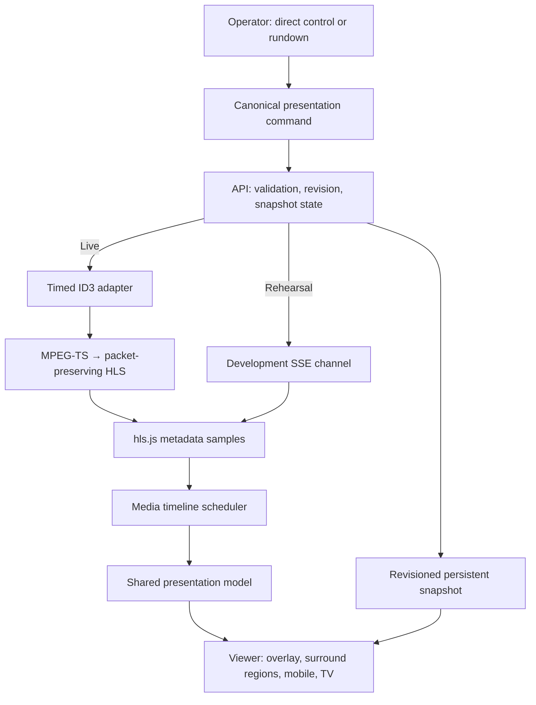

# ShowGather V1 Architecture

ShowGather V1 is a local interactive broadcast pilot. Its central rule is simple: **the video programme timeline is the authority for timed presentation**.

## System flow



## Responsibilities

| Layer | Responsibility | Must not own |
| --- | --- | --- |
| Admin | Operator intent, live/rehearsal selection, rundown workflow | Media-time scheduling |
| Presentation model | Logical regions, layering, expiry, restoration, rendering state | ID3, HLS, React, HTTP |
| Event schema | Compact wire-envelope validation | Graphic layout or API state |
| API | Command acceptance, durable revisions, snapshots, ID3 injection orchestration | Viewer layout |
| Timed adapter | Delivery of the compact `pc` envelope at programme time | Canonical presentation model |
| Player scheduler | Queueing against media PTS, seek policy, duplicate suppression | Operator business logic |
| Viewer | Responsive presentation of logical regions | Transport parsing rules |

## Command and transport model

Operator intent is translated into a canonical presentation command. V1 then uses a compact `pc` envelope for the timed transport path:

```text
Operator command
  → presentation command
  → compact `pc` event (optional durable revision `r`)
  → ID3 TPE1 / rehearsal SSE
  → media PTS scheduler
  → presentation commands in logical regions
```

The transport envelope is intentionally not the complete product model. It is byte-bounded for the current 127-byte ID3 TPE1 reference adapter. This lets future transports change without redefining rendering semantics.

## Persistent and transient state

V1 separates two delivery mechanisms:

| Mechanism | Used for | Behaviour |
| --- | --- | --- |
| Revisioned snapshot | Current durable state: score, ticker, persistent sponsor, clear | Hydrates late joins and reconnects |
| Timed metadata | Future and transient programme changes | Fires against media PTS; does not replay from a snapshot |

Durable changes receive monotonic revisions. The viewer rejects a snapshot older than the latest durable revision it has applied, suppresses matching durable metadata duplicates, and requests recovery after a revision gap.

## Logical presentation regions

The renderer targets logical regions, not screen coordinates:

```text
presentation
├── video.overlay
├── header
├── left.rail
├── right.rail
└── footer
```

Desktop, mobile, and TV profiles map this shared state differently. The mobile companion panels also derive from the same state; they are not a separate data product.

## Timing and recovery policy

- Pause freezes presentation progression because media time stops.
- Seek forward discards passed transient cues and retains future ones.
- Seek backward does not replay previously seen event IDs in one session.
- Reload creates a new session; durable state returns through snapshots.
- Temporary graphics expire by media PTS, not browser wall-clock time.

See [Pause, Seek, and Reload Behaviour](pause-seek-behaviour.md) for the full implementation policy.

## V1 boundaries

V1 deliberately does not provide persisted shows, accounts, multi-user operation, production deployment, asset management, or broad platform certification. Those are later product decisions; they do not alter the protected timing and presentation boundaries above.
